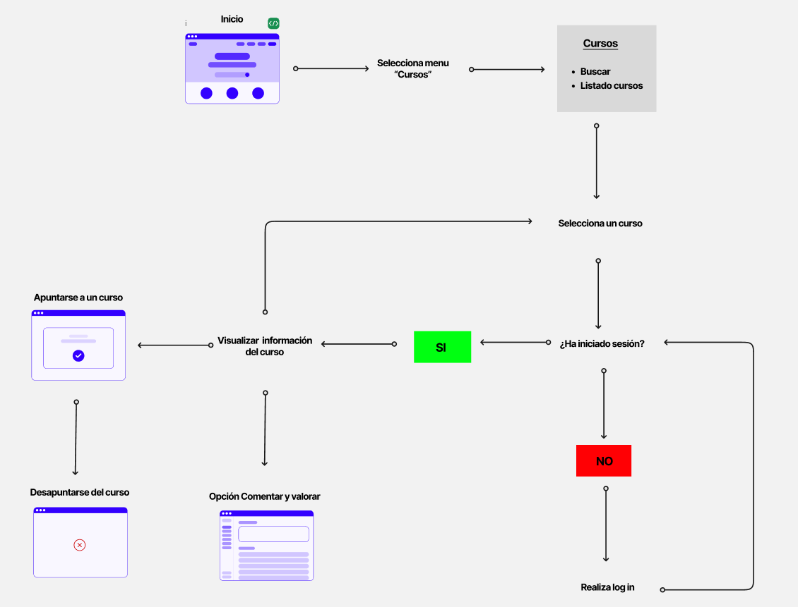

## DIU - Practica2, entregables

### Ideación 
* Malla receptora de información 
* Mapa de empatía
* Point of View 

El mapa de empatía de nuestro proyecto consiste en el caso de estudio de la realización de cursos de formación y talleres basados en artesanía. El resultado sería el siguiente:

### PROPUESTA DE VALOR
* ScopeCanvas

La propuesta de valor realizada en scope canvas es la siguiente:

### TASK ANALYSIS

* User Task Matrix 
* User/Task flow

 
 

| User Groups/Task | Usuario sube obras | Usuario valora obras | Usuario realiza cursos |
|:----------------:|:------------------:|:--------------------:|:----------------------:|
| Iniciar sesión   | Alta               |                      | Alta                   |
| Cerrar sesión    | Alta               |                      | Alta                   |
| Registrarse      |                    | Media                |                        |
| Borrar cuenta    | Baja               |                      |                        |
| Buscar cursos    | Alta               | Media                | Alta                   |
| Apuntarse a cursos | Alta             | Media                | Alta                   |
| Ver valoraciones | Media              | Alta                 | Media                  |
| Ver comentarios |                     | Alta                 | Alta                   | 
| Poner valoración |                    | Alta                 | Media                  |
| Poner comentario |                    | Alta                 | Media                  |
| Editar perfil | Alta                  |                      | Alta                   |
| Subir obras | Alta                    |                      | Media                  |       

### ARQUITECTURA DE INFORMACIÓN

* Sitemap 
* Labelling 

| Término                        | Significado                                                                 |
|-------------------------------|------------------------------------------------------------------------------|
| Inicio                        | Página principal con acceso a las secciones más importantes del sitio.       |
| Cursos                        | Página donde se puede buscar y visualizar el listado de cursos disponibles.  |
| Buscar (Cursos)               | Funcionalidad para buscar cursos aplicando distintos filtros.                |
| Listado cursos                | Sección que muestra todos los cursos disponibles en la plataforma.           |
| Apuntarse a un curso          | Página donde se visualizan los cursos para inscribirse. |
| Sobre nosotros                | Página informativa acerca de la organización o plataforma.                   |
| Preguntas frecuentes          | Sección de "Sobre nosotros" con respuestas a las dudas más comunes.          |
| Contacto                      | Información de contacto como email, teléfono, redes sociales, etc.           |
| Ubicación                     | Muestra la dirección y localización geográfica de la organización.           |
| Cuenta                        | Página desde donde se puede iniciar sesión o registrarse.                    |
| Iniciar sesión                | Página para acceder con una cuenta ya existente.                             |
| Registrarse                   | Página para crear una nueva cuenta en la plataforma.                         |
| Mis comentarios y valoraciones| Página con todos los comentarios y valoraciones realizados por el usuario.   |
| Mis cursos                    | Página que muestra los cursos en los que el usuario está inscrito.           |
| Perfil                        | Página que muestra los datos del usuario registrado.                         |
| Modifica datos                | Página para editar o actualizar los datos del perfil del usuario.            |
| Cerrar sesión                 | Opción para salir de la cuenta y cerrar la sesión activa.                    |

### Prototipo Lo-FI Wireframe 

Pagina principal o landing page

### Conclusiones  
(incluye valoración de esta etapa)

>>>> Este fichero se debe editar para que cada evidencia quede enlazada con el recurso subido a la carpeta de la practica. Se pide más detalle técnico en las descripciones de lo que sería el README principal del repositorio y que corresponde a la descripcion del Case Study.
>>>> Termine con la seccion de Conclusiones para aportar una valoración final del equipo sobre la propia realización de la práctica
