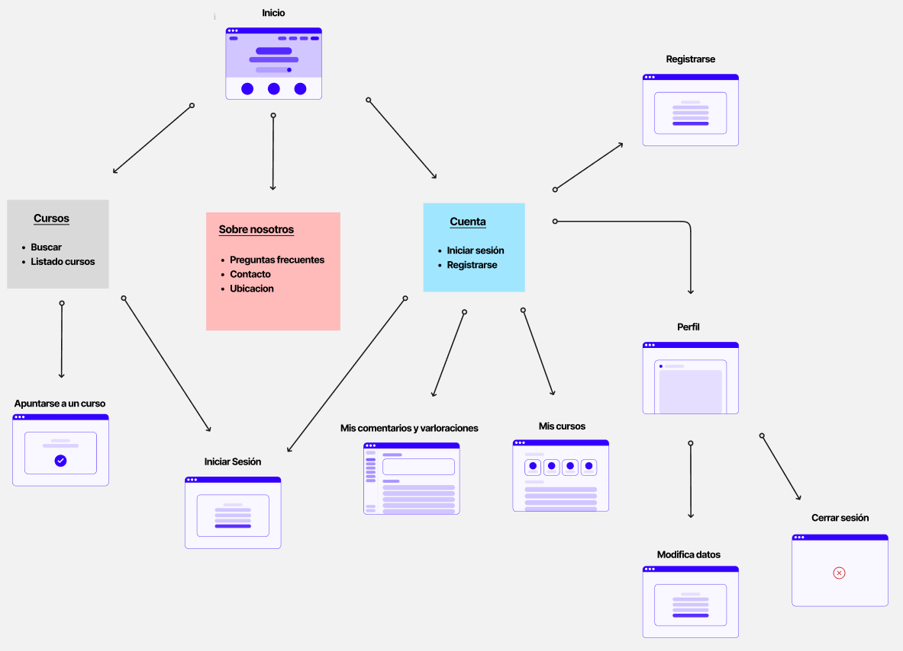

# DIU25
Prácticas Diseño Interfaces de Usuario (Tema: .... ) 

[Guiones de prácticas](GuionesPracticas/)

Grupo: DIU3_LobosHuargos.  Curso: 2024/25 

Actualizado: 26/02/2025

Proyecto: 

>>> Decida el nombre corto de su propuesta en la práctica 2 

Descripción: 

>>> Describa la idea de su producto en la práctica 2 

Logotipo: 

>>> Si diseña un logotipo para su producto en la práctica 3 pongalo aqui, a un tamaño adecuado. Si diseña un slogan añadalo aquí

Miembros:
 * :bust_in_silhouette:  Juan Jose Barrera Linde    :octocat:     
 * :bust_in_silhouette:  Jorge Cano Melero     :octocat:

>>> Los equipos son de 2 personas. Identifícaros con el nombre del Grupo y los enlaces a los perfiles de GitHub de cada integrante

----- 

>>> Este documento es el esqueleto del Case Study que explica el proceso de desarrollo de las 5 prácticas de DIU. Aparte de subir cada entrega a PRADO, se debe actualizar y dar formato de informe final a este documento online. Elimine este tipo de texto / comentarios desde la práctica 1 conforme proceda a cada paso

# Proceso de Diseño 

 

## Paso 1. UX User & Desk Research & Analisis 

>>> Cualquier título puede ser adaptado. Recuerda borrar estos comentarios del template en tu documento

### 1.a User Reseach Plan
 
-----

>>> Describe el plan en tu User Research (cómo se plantea la selección de usuarios). Borra esta línea cuando lo tengas.  

En esta práctica se va realizar un análisis de la usabilidad de aplicaciones web basadas en artesanía y reciclaje en la provincia de Granada. De estas aplicaciones, se ha seleccionado para su estudio
la página web "Kerarqueo". Hemos seleccionado esta plataforma porque pensamos que tiene bastantes puntos débiles que se podrían mejorar.

Kerarqueo es una cooperativa que ofrece productos artesanales de cerámica dedicada al Patrimonio además de reproducciones arqueológicas. No tenemos experiencia en este sector pero si hemos utilizado otras 
plataformas que nos permiten realizar la compra de productos (como por ejemplo Amazon) o la compra de cursos de formación (como por ejemplo Udemy). Partiendo de plataformas como las mencionadas anteriormente,
vamos a enfocar nuestra estrategia en la mejora de ventas de productos así como en mejorar y dar más visibilidad a los cursos de formación que puede ofrecer Kerarqueo.

La estrategia a seguir se basará en la consecución de los siguientes objetivos:

- Conocer las necesidades de los usuarios y sus motivaciones.
- Conocer el comportamiento de los usuarios interesados en dichos productos.
- Conseguir una experiencia satisfactoria por parte de los usuarios.

Para afrontar estos objetivos, será necesario analizar:

- Cuáles son los usuarios principales de la página, pudiendo ser turistas o coleccionistas (entre otros).
- Cuáles son los factores que influyen en la decisión de la compra, como la calidad o el precio.
- Cuál es el nivel de conocimiento que tienen sobre cerámica y arqueología.
- Qué problemas se encuentran a la hora de comprar estos productos.

Para realizar el análisis, se va a seguir el método de investigación basado en información cualitativa y cuantitativa:

- Información cualitativa
  
   - Entrevistas en profundidad, que nos permiten conocer las experiencias de los usuarios que han realizado compras sobre productos artesanales y que han realizado cursos de formación o talleres para 
     elaborar dichos productos. También servirá para conocer cuáles son las experiencias y problemas que hayan tenido a la hora de ralizar éstas actividades.
     
   - Observación de los usuarios en tiendas, ferias y directamente sobre la página, con el fin de poder encontrar pautas que sigan los usuarios al navegar por ésta y poder analizar con más claridad qué es lo que buscan.
     
   - Experiencia final del usuario, a través de reseñas, comentarios y opiniones al comprar un producto, realizar un taller o curso.
     
   - Foro de debate, donde los usuarios puedan expresar cuáles son sus inquietudes, gustos y problemas con experiencias relacionadas en empresas del sector.

- Información cuantitativa

   - Encuestas en redes sociales y en la página web, con el fin de conocer los hábitos de los usuarios y cuáles son sus preferencias.
     
   - Análisis de ventas y datos de las compras realizadas, para poder observar cuáles son los productos más vendidos y las temporadas en las que más demanada hay.
 
   - Análisis de los comentarios y "feedback" que proporcionen los usuarios.
 
   - Análisis de las actividades de los usuarios en la plataforma, como el número de visitas, páginas más visitadas o qué acciones son las más realizadas.

Finalmente, el perfil de los usuarios que se tendrán en cuenta en este análisis serán turistas, personas interesadas en souvenirs históricos, coleccionistas y personas interesadas en decoración.

### 1.b Competitive Analysis
 
-----

>>> Describe brevemente características de las aplicaciones que tiene asignadas tu grupo. Decidete por una y explica por qué se ha seleccionado. Borra esta línea cuando lo tengas. 

La aplicación web elegida para su estudio ha sido "Kerarqueo" (como se ha indicado previamente), debido a que hemos detectado defectos y características que pueden emporar la experiencia de usuario al visitar
dicha página.

Se han elegido una serie de empresas como competidoras para ver cómo abordan los defectos que se aprecian en la plataforma "Kearqueo". Las empresas elegidas han sido:

- Udemy: plataforma de cursos online que cuenta con una amplia variedad de cursos y con precios muy competitivos.

- Cuit: empresa dedicada al diseño, artesanía y experiencias en torno a la cerámica. Ofrecen distintos servicios como cursos de formación y también venden productos elaborados artesanalmente.

- Artesanía Álvarez: empresa dedicada a la elaboración de productos artesanales en Granada. Esta es una empresa interesante de comparar puesto que está en la misma provincia y supone una competencia directa.
  Además, Google posicina esta página de las primeras al realizar una búsqueda de productos artesanos en Granada.

A continuación se muestra el análisis competitivo realizado, donde se han tenido en cuenta distintos aspectos:

Consideramos que finalmente el mejor competidor sería "Cuit" por ser un competidor directo que ofrece los mismos servicios que "Kerarqueo" a unos precios muy competitivos y con una experiencia de usuario bastante más alta.

### 1.c Personas
 
-----

>>> Junto con la captura de pantalla de la ficha de la persona, haz una breve descripción de la misma. Recuerda que son dos. Los recursos de imagen deberán estar dentro de la carpeta P1/ Cuando termines, borra esta línea.  

### 1.d User Journey Map
 
----

>>> Describe el porqué de las dos experiencias de usuario contadas en el journey map. Por ejemplo, reflexiona si te parece que son habituales. Enlaza con los recursos journey que están en la carpeta P1/. Borra esta linea del template cuando termines.  

### 1.e Usability Review
 
----

>>>  El objetivo es revisar la usabilidad del competidor seleccionado. Usamos un checklist de verificación. Tras usarlo, subelo a la carpeta P1/ Ofrece aquí un parrafo para:
>>> - Enlace al documento:  (xls/pdf) 
>>> - URL y Valoración numérica obtenida: 
>>> - Comentario sobre la revisión:  (puntos fuertes y débiles detectados)

 

- Enlace al documento "Usability Review":

- Puntuación final obtenida del análisis:
  

- Comentario sobre la valoración obtenida:

  Tras el análisis de experiencia de usuario realizado, vamos a desglosar los puntos que consideramos necesarios para que dicha experiencia sea satisfactoria:

  - Mejorar la usabilidad de la página a través de una estructura uniforme, bien definida, donde las fuentes (texto e imágenes) y los colores sean los mismos al navegar entre páginas y que la información se pueda
    transmitir con facilidad, siendo clara y concisa.

  - Conseguir que la venta de artículos y los cursos/talleres que ofrecen sea la actividad principal, apareciendo de manera directa al acceder a la página.
 
  - Mejorar la funcionalidad del carrito de compra, puesto que no está implementado y la alternativa que tienen es muy confusa. 
 
  - Uso de herramientas como una barra de búsqueda que permita búsquedas de manera inmediata, favoreciendo a clientes habituales y consiguiendo que la compra de productos en general sea más directa.
 
  - Apostar por el marketing y visibilidad, haciendo que los enlaces a redes sociales como Instagram o Facebook funcionen de manera correcta y que siempre estén presentes al navegar en la plataforma (a través del footer, por ejemplo) y       que se pueda acceder a la ubicación directamente a través de Google Maps si el cliente lo desea.

Consiguiendo mejorar los aspectos tenidos en cuenta anteriormente, se puede obtener una página con un diseño mucho más atractivo, que transmita sus productos de forma clara, rápida y sencilla, colocándose a la altura de los competidores y consiguiendo una experiencia satisfactoria por parte de los usuarios.

## Paso 2. UX Design  

>>> Cualquier título puede ser adaptado. Recuerda borrar estos comentarios del template en tu documento

### 2.a Reframing / IDEACION: Feedback Capture Grid / EMpathy map 
 
----

>>> Comenta con un diagrama los aspectos más destacados a modo de conclusion de la práctica anterior. De qué carece la competencia?? Tu diagrama puede ser una figura subida a la carpeta P2/

 Interesante | Críticas     
| ------------- | -------
  Preguntas | Nuevas ideas
  
    
>>> Explica el Problema y plantea una hipótesis. Es decir, explica aquí qué 
>>> se plantea como "propuesta de valor" para un nuevo diseño de aplicación propio

### 2.b ScopeCanvas

----

>>> Propuesta de valor, pero ahora en vez de un texto es un ScopeCanvas que has subido a P2/ y enlazado desde aqui. Tambien vale una imagen miniatura del recurso.
>>> No olvides que tu propuesta ya tiene un nombre corto y puedes actualizar la cabecera de este archivo

### 2.b User Flow (task) analysis 
 
-----

>>> Definir "User Map" y "Task Flow" ... enlazar desde P2/ y describir brevemente

### 2.c IA: Sitemap + Labelling 
 
----

>>> Identificar términos para diálogo con usuario (evita el spanglish) y la arquitectura de la información. Es muy apropiado un diagrama tipo sitemap y una tabla que se ampliaría para llevar asociado la columna iconos (tanto para la web como para una app). 

Término | Significado     
| ------------- | -------
  Login  | acceder a plataforma

### 2.d Wireframes
 
-----

>>> Plantear el diseño del layout para Web/movil (organización y simulación). Describa la herramienta usada 

 

## Paso 3. Mi UX-Case Study (diseño)

>>> Cualquier título puede ser adaptado. Recuerda borrar estos comentarios del template en tu documento

### 3.a Moodboard

-----

>>> Diseño visual con una guía de estilos visual (moodboard) 
>>> Incluir Logotipo. Todos los recursos estarán subidos a la carpeta P3/
>>> Explique aqui la/s herramienta/s utilizada/s y el por qué de la resolución empleada. Reflexione ¿Se puede usar esta imagen como cabecera de Instagram, por ejemplo, o se necesitan otras?

### 3.b Landing Page
 
----

>>> Plantear el Landing Page del producto. Aplica estilos definidos en el moodboard

### 3.c Guidelines
 
----

>>> Estudio de Guidelines y explicación de los Patrones IU a usar 
>>> Es decir, tras documentarse, muestre las deciones tomadas sobre Patrones IU a usar para la fase siguiente de prototipado. 

### 3.d Mockup
 
----

>>> Consiste en tener un Layout en acción. Un Mockup es un prototipo HTML que permite simular tareas con estilo de IU seleccionado. Muy útil para compartir con stakeholders

### 3.e ¿My UX-Case Study?
 
-----

>>> Publicar my Case Study en Github... Es el momento de dejar este documento para que sea evaluado y calificado como parte de la práctica
>>> Documente bien la cabecera y asegurese que ha resumido los pasos realizados para el diseño de su producto

 

## Paso 4. Pruebas de Evaluación 

### 4.a Reclutamiento de usuarios 

-----

>>> Breve descripción del caso asignado (llamado Caso-B) con enlace al repositorio Github
>>> Tabla y asignación de personas ficticias (o reales) a las pruebas. Exprese las ideas de posibles situaciones conflictivas de esa persona en las propuestas evaluadas. Mínimo 4 usuarios: asigne 2 al Caso A y 2 al caso B.

| Usuarios | Sexo/Edad     | Ocupación   |  Exp.TIC    | Personalidad | Plataforma | Caso
| ------------- | -------- | ----------- | ----------- | -----------  | ---------- | ----
| User1's name  | H / 18   | Estudiante  | Media       | Introvertido | Web.       | A 
| User2's name  | H / 18   | Estudiante  | Media       | Timido       | Web        | A 
| User3's name  | M / 35   | Abogado     | Baja        | Emocional    | móvil      | B 
| User4's name  | H / 18   | Estudiante  | Media       | Racional     | Web        | B 

### 4.b Diseño de las pruebas 
 
-----

>>> Planifique qué pruebas se van a desarrollar. ¿En qué consisten? ¿Se hará uso del checklist de la P1?

### 4.c Cuestionario SUS
 
----

>>> Como uno de los test para la prueba A/B testing, usaremos el **Cuestionario SUS** que permite valorar la satisfacción de cada usuario con el diseño utilizado (casos A o B). Para calcular la valoración numérica y la etiqueta linguistica resultante usamos la [hoja de cálculo](https://github.com/mgea/DIU19/blob/master/Cuestionario%20SUS%20DIU.xlsx). Previamente conozca en qué consiste la escala SUS y cómo se interpretan sus resultados
http://usabilitygeek.com/how-to-use-the-system-usability-scale-sus-to-evaluate-the-usability-of-your-website/)
Para más información, consultar aquí sobre la [metodología SUS](https://cui.unige.ch/isi/icle-wiki/_media/ipm:test-suschapt.pdf)
>>> Adjuntar en la carpeta P4/ el excel resultante y describa aquí la valoración personal de los resultados 

### 4.d A/B Testing
 
-----

>>> Los resultados de un A/B testing con 3 pruebas y 2 casos o alternativas daría como resultado una tabla de 3 filas y 2 columnas, además de un resultado agregado global. Especifique con claridad el resultado: qué caso es más usable, A o B?

### 4.e Aplicación del método Eye Tracking 

----

>>> Indica cómo se diseña el experimento y se reclutan los usuarios. Explica la herramienta / uso de gazerecorder.com u otra similar. Aplíquese únicamente al caso B.

  
>>> Cambiar esta img por una de vuestro experimento. El recurso deberá estar subido a la carpeta P4/  

>>> gazerecorder en versión de pruebas puede estar limitada a 3 usuarios para generar mapa de calor (crédito > 0 para que funcione) 

### 4.f Usability Report de B
 
-----

>>> Añadir report de usabilidad para práctica B (la de los compañeros) aportando resultados y valoración de cada debilidad de usabilidad. 
>>> Enlazar aqui con el archivo subido a P4/ que indica qué equipo evalua a qué otro equipo.

>>> Complementad el Case Study en su Paso 4 con una Valoración personal del equipo sobre esta tarea

 

## Paso 5. Exportación y Documentación 

### 5.a Exportación a HTML/React
 
----

>>> Breve descripción de esta tarea. Las evidencias de este paso quedan subidas a P5/

### 5.b Documentación con Storybook

----

>>> Breve descripción de esta tarea. Las evidencias de este paso quedan subidas a P5/

 

## Conclusiones finales & Valoración de las prácticas

>>> Opinión FINAL del proceso de desarrollo de diseño siguiendo metodología UX y valoración (positiva /negativa) de los resultados obtenidos. ¿Qué se puede mejorar? Recuerda que este tipo de texto se debe eliminar del template que se os proporciona 

