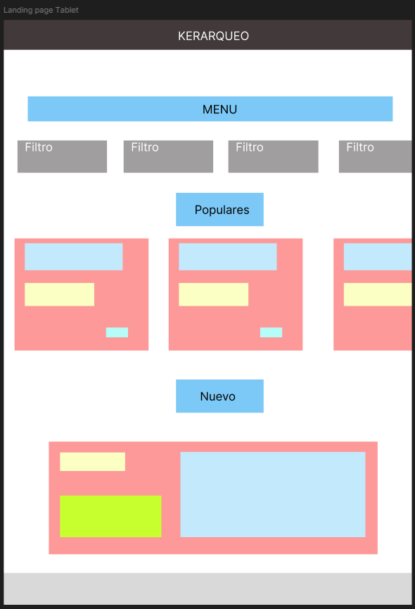

# DIU25
Prácticas Diseño Interfaces de Usuario (Tema: .... ) 

[Guiones de prácticas](GuionesPracticas/)

Grupo: DIU3_LobosHuargos.  Curso: 2024/25 

Actualizado: 26/02/2025

Proyecto: 

Crusos de artesanía - Arte hecho a mano

Descripción: 

Mejora de la aplicación de Kerarqueo apostando por la realización de cursos por parte de los usuarios, donde puedan subir las obras que realicen a partir de esos cursos y también puedan participar dando valoraciones y comentarios a obras realizadas por otros usuarios, creando una comunidad rica tanto a nivel cultural como social. 

Logotipo: 

Mockup:

[Enlace a nuestro mockup](https://www.figma.com/proto/MUWuLS9xKcCANr43cYKqyi/Arte-hecho-a-mano---MOCKUP?node-id=118-392&t=iOoIP06W9lg8XfIu-0&scaling=scale-down&content-scaling=fixed&page-id=0%3A1&starting-point-node-id=113%3A185)

Miembros:
 * :bust_in_silhouette:  Juan Jose Barrera Linde    :octocat:     
 * :bust_in_silhouette:  Jorge Cano Melero     :octocat:

>>> Los equipos son de 2 personas. Identifícaros con el nombre del Grupo y los enlaces a los perfiles de GitHub de cada integrante

----- 

>>> Este documento es el esqueleto del Case Study que explica el proceso de desarrollo de las 5 prácticas de DIU. Aparte de subir cada entrega a PRADO, se debe actualizar y dar formato de informe final a este documento online. Elimine este tipo de texto / comentarios desde la práctica 1 conforme proceda a cada paso

# Proceso de Diseño 

 

## Paso 1. UX User & Desk Research & Analisis 

### 1.a User Reseach Plan
 
----- 

En esta práctica se va realizar un análisis de la usabilidad de aplicaciones web basadas en artesanía y reciclaje en la provincia de Granada. De estas aplicaciones, se ha seleccionado para su estudio
la página web "Kerarqueo". Hemos seleccionado esta plataforma porque pensamos que tiene bastantes puntos débiles que se podrían mejorar.

Kerarqueo es una cooperativa que ofrece productos artesanales de cerámica dedicada al Patrimonio además de reproducciones arqueológicas. No tenemos experiencia en este sector pero si hemos utilizado otras 
plataformas que nos permiten realizar la compra de productos (como por ejemplo Amazon) o la compra de cursos de formación (como por ejemplo Udemy). Partiendo de plataformas como las mencionadas anteriormente,
vamos a enfocar nuestra estrategia en la mejora de ventas de productos así como en mejorar y dar más visibilidad a los cursos de formación que puede ofrecer Kerarqueo.

La estrategia a seguir se basará en la consecución de los siguientes objetivos:

- Conocer las necesidades de los usuarios y sus motivaciones.
- Conocer el comportamiento de los usuarios interesados en dichos productos.
- Conseguir una experiencia satisfactoria por parte de los usuarios.

Para afrontar estos objetivos, será necesario analizar:

- Cuáles son los usuarios principales de la página, pudiendo ser turistas o coleccionistas (entre otros).
- Cuáles son los factores que influyen en la decisión de la compra, como la calidad o el precio.
- Cuál es el nivel de conocimiento que tienen sobre cerámica y arqueología.
- Qué problemas se encuentran a la hora de comprar estos productos.

Para realizar el análisis, se va a seguir el método de investigación basado en información cualitativa y cuantitativa:

- Información cualitativa
  
   - Entrevistas en profundidad, que nos permiten conocer las experiencias de los usuarios que han realizado compras sobre productos artesanales y que han realizado cursos de formación o talleres para 
     elaborar dichos productos. También servirá para conocer cuáles son las experiencias y problemas que hayan tenido a la hora de ralizar éstas actividades.
     
   - Observación de los usuarios en tiendas, ferias y directamente sobre la página, con el fin de poder encontrar pautas que sigan los usuarios al navegar por ésta y poder analizar con más claridad qué es lo que buscan.
     
   - Experiencia final del usuario, a través de reseñas, comentarios y opiniones al comprar un producto, realizar un taller o curso.
     
   - Foro de debate, donde los usuarios puedan expresar cuáles son sus inquietudes, gustos y problemas con experiencias relacionadas en empresas del sector.

- Información cuantitativa

   - Encuestas en redes sociales y en la página web, con el fin de conocer los hábitos de los usuarios y cuáles son sus preferencias.
     
   - Análisis de ventas y datos de las compras realizadas, para poder observar cuáles son los productos más vendidos y las temporadas en las que más demanada hay.
 
   - Análisis de los comentarios y "feedback" que proporcionen los usuarios.
 
   - Análisis de las actividades de los usuarios en la plataforma, como el número de visitas, páginas más visitadas o qué acciones son las más realizadas.

Finalmente, el perfil de los usuarios que se tendrán en cuenta en este análisis serán turistas, personas interesadas en souvenirs históricos, coleccionistas y personas interesadas en decoración.

### 1.b Competitive Analysis
 
-----

La aplicación web elegida para su estudio ha sido "Kerarqueo" (como se ha indicado previamente), debido a que hemos detectado defectos y características que pueden emporar la experiencia de usuario al visitar
dicha página.

Se han elegido una serie de empresas como competidoras para ver cómo abordan los defectos que se aprecian en la plataforma "Kearqueo". Las empresas elegidas han sido:

- Udemy: plataforma de cursos online que cuenta con una amplia variedad de cursos y con precios muy competitivos.

- Cuit: empresa dedicada al diseño, artesanía y experiencias en torno a la cerámica. Ofrecen distintos servicios como cursos de formación y también venden productos elaborados artesanalmente.

- Artesanía Álvarez: empresa dedicada a la elaboración de productos artesanales en Granada. Esta es una empresa interesante de comparar puesto que está en la misma provincia y supone una competencia directa.
  Además, Google posicina esta página de las primeras al realizar una búsqueda de productos artesanos en Granada.

A continuación se muestra el análisis competitivo realizado, donde se han tenido en cuenta distintos aspectos:

Consideramos que finalmente el mejor competidor sería "Cuit" por ser un competidor directo que ofrece los mismos servicios que "Kerarqueo" a unos precios muy competitivos y con una experiencia de usuario bastante más alta.

### 1.c Personas
 
-----

Loretta es una chica francesa que trabaja como diseñadora de interior en Francia. Tiene su propia empresa y le encanta viajar por todo el mundo, aprendiendo nuevas culturas y arte que pueda incluir como posibles diseños para sus proyectos de interiorismo. Viaja a Granada y se queda maravillada con su arte, por lo que decide comprar artículos artesanos y busca una tienda que pueda ofrecérselos.

Ted, consultor empresarial que viaja frecuentemente, disfruta de eventos privados sobre artesanía y colecciona piezas exclusivas. Busca plataformas digitales para contactar con artesanos y reservar compras o experiencias con antelación.

### 1.d User Journey Map
 
----

Loretta va a comprar un producto artesano y busca una tienda online donde pueda comprarlo. Se ha elegido esta experiencia porque Kerarqueo ofrece este tipo de servicio y sería un caso que podría ocurrir.

Ted asiste a una conferencia en Barcelona y, durante su tiempo libre, busca piezas de cerámica artesanal para agregar a su colección privada. Quiere contactar con un artesano local que trabaje con técnicas tradicionales y necesita una plataforma donde pueda ver su trabajo, confirmar que lo ha realizado el propio artesano y reservar una compra antes de regresar a EE.UU.

### 1.e Usability Review
 
----

- Enlace al documento PDF "Usability Review":

- Valoración numérica obtenida del análisis: 56

- Comentario sobre la valoración obtenida:

  Tras el análisis de experiencia de usuario realizado, vamos a desglosar los puntos que consideramos necesarios para que dicha experiencia sea satisfactoria:

  - Mejorar la usabilidad de la página a través de una estructura uniforme, bien definida, donde las fuentes (texto e imágenes) y los colores sean los mismos al navegar entre páginas y que la información se pueda
    transmitir con facilidad, siendo clara y concisa.

  - Conseguir que la venta de artículos y los cursos/talleres que ofrecen sea la actividad principal, apareciendo de manera directa al acceder a la página.
 
  - Mejorar la funcionalidad del carrito de compra, puesto que no está implementado y la alternativa que tienen es muy confusa. 
 
  - Uso de herramientas como una barra de búsqueda que permita búsquedas de manera inmediata, favoreciendo a clientes habituales y consiguiendo que la compra de productos en general sea más directa.
 
  - Apostar por el marketing y visibilidad, haciendo que los enlaces a redes sociales como Instagram o Facebook funcionen de manera correcta y que siempre estén presentes al navegar en la plataforma (a través del footer, por ejemplo) y       que se pueda acceder a la ubicación directamente a través de Google Maps si el cliente lo desea.

Consiguiendo mejorar los aspectos tenidos en cuenta anteriormente, se puede obtener una página con un diseño mucho más atractivo, que transmita sus productos de forma clara, rápida y sencilla, colocándose a la altura de los competidores y consiguiendo una experiencia satisfactoria por parte de los usuarios.

## Paso 2. UX Design  

### 2.a Reframing / IDEACION: Feedback Capture Grid / EMpathy map 
 
----
  
Hemos realizado un mapa de empatía basado en el caso de estudio de la realización de cursos de formación y talleres de artesanía. El resultado ha sido el siguiente:

La propuesta de valor que hemos planteado se basa en una plataforma que realiza cursos de formación de artesanía, donde los usuarios se puedan registrar en la página y realizar los cursos de formación que se ofrecen. Además, podrán subir las obras que hayan realizado como resultado de esos cursos y recibir comentarios y valoraciones de otros usuarios de la plataforma. Los usuarios podrán buscar las obras a través de distintos tipos de filtros (como las obras mejores valoradas), y ver quiénes han sido los que la han realizado, con el fin de ver los resultados que podrían alcanzar al realizar dichos cursos. 

### 2.b ScopeCanvas

----

Nuestra propuesta de valor realizada con scope canvas es la siguiente:

### 2.b User Flow (task) analysis 
-----

El task analysis relacionado con nuestra propuesta de valor sería el siguiente:

| User Groups/Task | Usuario sube obras | Usuario valora obras | Usuario realiza cursos |
|:----------------:|:------------------:|:--------------------:|:----------------------:|
| Iniciar sesión   | Alta               |                      | Alta                   |
| Cerrar sesión    | Alta               |                      | Alta                   |
| Registrarse      | Baja               | Media                | Baja                   |
| Borrar cuenta    | Baja               |                      | Baja                   |
| Buscar cursos    | Alta               | Media                | Alta                   |
| Apuntarse a cursos | Alta             | Media                | Alta                   |
| Ver valoraciones | Media              | Alta                 | Media                  |
| Ver comentarios |                     | Alta                 | Alta                   | 
| Poner valoración |                    | Alta                 | Media                  |
| Poner comentario |                    | Alta                 | Media                  |
| Editar perfil | Alta                  |                      | Alta                   |
| Subir obras | Alta                    |                      | Media                  |       

El task flow que hemos realiazdo ha sido de las tareas iniciar sesión y apuntarse a un curso. Los resultados obtenidos han sido los siguientes:

 
 

### 2.c IA: Sitemap + Labelling 
 
----

El sitemap de nuestra página tendría la siguiente distribución

| Término                        | Significado                                                                 |
|-------------------------------|------------------------------------------------------------------------------|
| Inicio                        | Página principal con acceso a las secciones más importantes del sitio.       |
| Cursos                        | Página donde se puede buscar y visualizar el listado de cursos disponibles.  |
| Buscar (Cursos)               | Funcionalidad para buscar cursos aplicando distintos filtros.                |
| Listado cursos                | Sección que muestra todos los cursos disponibles en la plataforma.           |
| Apuntarse a un curso          | Página donde se visualizan los cursos para inscribirse. |
| Sobre nosotros                | Página informativa acerca de la organización o plataforma.                   |
| Preguntas frecuentes          | Sección de "Sobre nosotros" con respuestas a las dudas más comunes.          |
| Contacto                      | Información de contacto como email, teléfono, redes sociales, etc.           |
| Ubicación                     | Muestra la dirección y localización geográfica de la organización.           |
| Cuenta                        | Página desde donde se puede iniciar sesión o registrarse.                    |
| Iniciar sesión                | Página para acceder con una cuenta ya existente.                             |
| Registrarse                   | Página para crear una nueva cuenta en la plataforma.                         |
| Mis comentarios y valoraciones| Página con todos los comentarios y valoraciones realizados por el usuario.   |
| Mis cursos                    | Página que muestra los cursos en los que el usuario está inscrito.           |
| Perfil                        | Página que muestra los datos del usuario registrado.                         |
| Modifica datos                | Página para editar o actualizar los datos del perfil del usuario.            |
| Cerrar sesión                 | Opción para salir de la cuenta y cerrar la sesión activa.                    |

### 2.d Wireframes
 
-----

El prototipo realizado a papel es el siguiente:

Los wireframes elaborados en base a ese prototipo con Figma son los siguientes: 

Pagina principal responsive para movil

Pagina principal responsive para tablet

Pagina principal responsive para Escritorio

Página de inicio de sesión

Página de acceso a curso para ver la información e inscribirse

Página de subida de una obra

Página para el perfil del usuario

 

## Paso 3. Mi UX-Case Study (diseño)

### 3.a Moodboard

-----

Para la realización del moodboard se ha utilizado una plantilla de Figma, y esta incluye:

- El nombre de nuestro proyecto ("Arte hecho a mano"), junto con la propuesta de valor.
- Logotipo con distintos colores.
- Paleta de colores que se va a utilizar en la aplicación.
- La tipografía.
- Imágenes que contendrá la apliación.

El resultado obtenido es el siguiente:

### 3.b Landing Page
 
----

El Landing Page de nuestra aplicación es la siguiente:

Los colores utilizados en la landing page, tipografía e imágenes serán utilizadas en el diseño del mockup.

### 3.c Guidelines
 
----

El diseño de nuestra aplicación se centra en la eficiencia y navegación rápida, permitiendo tener en cualquier momento acceso a todas las páginas de la aplicación (menú inferior), mostrando la información de forma clara, y consiguiendo que el usuario no se pierda en la página y pueda acceder rápidamente a cualquier opción. En cuanto a la paleta de colores, se han elegido colores que muestran paz y tranquilidad a la vez que simbolizan la naturaleza.

Algunos de los componentes y patrones utilizados son los siguientes:

- Página de inicio: página principal que vería el usuario al entrar en la aplicación. Esta página corresponde al landing page.

- Search: barra de búsqueda de cursos.

- Filtros: opciones que permiten filtrar los cursos en base a distintas categorías.

- Carrousel de cursos populares, mostrados a través de cards.

- Curso de interés o de relevancia, mostrado a través de card.

- Cards para representar la información de cada curso cuando se selecciona, con imagen del curso y una descripción, además del botón que permite la subscripción al curso.

- Menú de navegación inferior, que permite rápidamente vovler al landing page, mostrar las notificaciones, mostrar todos los cursos, subir una obra y mostrar los cursos subscritos. Es te menú de navegación está siempre disponible para permitir una navegación rápida e intuitiva entre las distintas páginas.

- Menú lateral: al pulsar el botón "hamburguesa" de la paǵina principal, se abrirá un menú desplegable en el lateral de la pantalla que muestra enlaces a las distintas páginas de la aplicación.

- Perfil: esta página cuenta con un formulario que contiene la información y datos relacionados con el usuario, permitiendo modificar sus datos en caso necesario.

- Listado de cursos: se muestra a través de cards todos los cursos que hay disponibles. Cuenta con un botón cada card (curso) para subscribirse/apuntrase.

- Cursos subscrito: se muestra a través de cards todos los cursos en los que está subscrito el usuario. Se permite desubscribirse del curso en caso de pulsar el botón que contiene cada card.

- Subir obra: opción que permite al usuario poder subir una obra. Se ha dejado un campo para indicar la zona donde se adjuntaría la obra, otra para el título y otra para la descripción.

- Formulario, para la opción del perfil del usuario.

Algunos de los componentes mencionados tienen la siguiente forma:

Cards con carruosel

Menú lateral desplegable

Formulario

El diseño final de nuestra aplicación en Figma es el siguiente:

### 3.d Mockup
 
----

El enlace a nuestro MMockup es el siguiente:

[Enlace a nuestro mockup](https://www.figma.com/proto/MUWuLS9xKcCANr43cYKqyi/Arte-hecho-a-mano---MOCKUP?node-id=118-392&t=iOoIP06W9lg8XfIu-0&scaling=scale-down&content-scaling=fixed&page-id=0%3A1&starting-point-node-id=113%3A185)

### 3.e ¿My UX-Case Study?
 
-----

>>> Publicar my Case Study en Github... Es el momento de dejar este documento para que sea evaluado y calificado como parte de la práctica
>>> Documente bien la cabecera y asegurese que ha resumido los pasos realizados para el diseño de su producto

 

## Paso 4. Pruebas de Evaluación 

### 4.a Reclutamiento de usuarios 

-----

- Caso B:

https://github.com/Maguitos/UX_CaseStudy

Proyecto "Maguitos" es un modelo de cursos de cerámica enfocados a la ampliación de lore de un mundo de fantasía inspirado en la andalucía medieval. Se ofrecerían cursos de distinto tipo y para distintas edades, pero todos enfocados a la creación o decoración de piezas de cerámica. En ellos se generarían ideas para ir añadiendo al mundo de fantasía y todo esto quedaría registrado en una wiki que puede ser consultada y navegada. La wiki tendrá como página principal un mapa, mostrando localizaciones importantes y está dividida en varias secciones con entradas conectadas entre ellas.

- Personas participantes en el estudio:

| Usuarios | Sexo/Edad     | Ocupación   |  Exp.TIC    | Personalidad | Plataforma | Caso
| ------------- | -------- | ----------- | ----------- | -----------  | ---------- | ----
| 0  | H / 26   | Estudiante  | Media       | Introvertido | Web.       | A 
| 1  | M / 18   | Estudiante  | Media       | Timido       | Web        | A 
| 2  | M / 55   | Trabajadora | Baja        | Emocional    | Móvil      | B 
| 3  | H / 21   | Trabajador  | Alta       | Racional     | Móvil        | B 

Jonathan podría tener problemas ya que no es una persona experimentada con las aplicaciones web, tiene poca experiencia en tecnologias, solo ha usado aplicaciones para pedir comida a domicilio.

### 4.b Diseño de las pruebas 
 
-----

Hemos diseñado una serie de pruebas desde Maze para el A/B Testing. Estas pruebas son las siguientes:

- Caso A:

    - [Desubscribirse un curso](https://t.maze.co/389433178)

  Para el caso A, el test consiste en tener en cuenta que te has subscrito a varios cursos en la página web, el objetivo he desubscribirse en algun curso y obtener un mensaje de que se ha realizado correctamente.

- Caso B:

    - [Reservar un curso](https://t.maze.co/389465910?guerilla=true)

 Para el caso B, el test consiste en realizar una navegación por la página hasta poder encontrar la forma de realizar la reserva de un curso. Posteriormente se le realizan una serie de preguntas sobre la experiencia que ha tenido al usar la aplicación.

Otras pruebas que se han diseñado han sido el "Eye Tracking" y el cuestionario "SUS". Estas pruebas serán comentadas a continuación.

### 4.c Cuestionario SUS
 
----

Nosotros hemos optado por usar SUS Calculator:
https://stuart-cunningham.github.io/sus/

Resultados:
Jonathan: 67.5 aceptable

 

Maria: 80 buena

 

### 4.d A/B Testing
 
-----

Los usuarios que han realizado el test de Maze para el caso B han concluido que la tarea de reservar un curso no es complicada del todo; se puede encontrar con facilidad. Por una parte, es cierto que cuando llegaban a la última pantalla donde salía el mapa no entendían muy bien donde podría estar la opción de reservar el curso, se intuía que las localizaciones eran las zonas donde estarían disponibles los cursos. Además, la experiencia de usuario no fué del todo satisfactoria, pensaban que había algunas cosas que se podrían mejorar de la interfaz para que fuese más "bonita" (aunque funcional es).

Los usuarios que han realizado el test de Maze para el caso A han concluido que la navegación por la aplicación está muy lograda (buena experiencia de usuario); aunque han tardado un poco de tiempo en encontrar donde estaría la zona en la que están los cursos a los que estaría subscrito (opción del menú inferior). Al final, a base de ir probando en opciones lo han acabado encontrando. Destacar que sus conclusiones en general han sido buenas en cuanto a la usabilidad del sistema ya que han conseguido realizar la tarea dada, además de ver otras opciones funcionales en la aplicación mientras navegaban por ella.

Las evaluaciones de los resultados obtenidos por las pruebas A/B testing, vienen en el cuestionario SUS que hemos mostrado en el apartado anterior par algunos de estos usuarios que han realizado las pruebas.

### 4.e Aplicación del método Eye Tracking 

----

- Caso B

Para esta prueba, hemos usado Gaze Recorder. Esta web permite poder analizar que está viendo el usuario en la pantalla a través de un mapa de calor. 
El test va a comprobar qué zonas son las que más ve el usuario y si puede reservar un curso correctamente el navegar por la web. 

El enlace al test de Gaze Recorder es el siguiente:

- [Reservar un curso](https://app.gazerecorder.com/Study/Test?StudyID=483956fe7f3e33f13ce9e81ee58f6e78&lang=es&RespondentID=null)

Los resultados obtenidos son los siguientes:

Se puede observar como el usuario está viendo más o menos las zonas adecuadas que le llevan a poder reservar un curso. 

- Caso A

Para el caso A hemos realizado un test en Gaze Recorder también en el que se va a comprobar si el usuario sabría en este caso como poder desubscribirse (borrarse) de un curso del que ya estaba subscrito

Este es el enlace del test en Gaze Recorder: 

 - [Desubscribirse de un curso](https://app.gazerecorder.com/Study/Test?StudyID=d89db1f5b70c274496073ffb7cd92b39&lang=en&RespondentID=null)

Los resultados obtenidos han sido los siguientes:

Como se puede observar, aproximadamente el usuario está observando los sitios indicados aunque es cierto que en la página de inicio es un poco complicado saber de primeras donde podría estar la opción que permite listar los cursos a los que se está subscrito.

### 4.f Usability Report de B
 
-----

# Usability Report

#### Evaluación de usabilidad del proyecto 

### Maguitos

### 28/05/2025

[\[Enlace a GITHUB del proyecto\]](https://github.com/Maguitos/UX_CaseStudy)

### Realizado por:

Juan José Barrera Linde y Jorge Cano Melero con experiencia en diseño UX/UI. En este informe aplicamos lo aprendido sobre test de usabilidad para mejorar una aplicación web interactiva, para ello usamos la base de conocimiento adquirida en esta asignatura.

## 1 DESCRIPCIÓN DEL WEBSITE

Proyecto "Maguitos" es un modelo de cursos de cerámica enfocados a la ampliación de lore de un mundo de fantasía inspirado en la andalucía medieval. Se ofrecerían cursos de distinto tipo y para distintas edades, pero todos enfocados a la creación o decoración de piezas de cerámica. En ellos se generarían ideas para ir añadiendo al mundo de fantasía y todo esto quedaría registrado en una wiki que puede ser consultada y navegada. La wiki tendrá como página principal un mapa, mostrando localizaciones importantes y está dividida en varias secciones con entradas conectadas entre ellas. 

## 2 RESUMEN EJECUTIVO

Los resultados de la prueba de usabilidad realizada a partir de un prototipo elaborado con el proyecto "Maguitos" están recogidos en este informe. Su finalidad fue detectar posibles problemas relacionados con la navegación, la comprensión y la accesibilidad, sobre todo en los resultados de cómo se visualizaba un mapa y de cómo se conectaban los cursos con la wiki.

Problemas detectados:

- Dificultad para darse cuenta de que el mapa es interactivo.

- Algunos usuarios no supieron interpretar de inmediato cómo se relacionaban los mismos cursos con el contenido de la wiki.

- Texto muy denso en algunas secciones.

## 3 METODOLOGIA 

#### Metodología de usabililidad

Se llevaron a cabo pruebas manuales con tareas específicas, observación apropiada y también encuesta SUS al final de la actividad. Se han realizado tareas con maze para detectar y obtener más detalles de su usabilidad.

Se llevan a cabo las siguientes técnicas:

- Test moderado con tareas específicas dentro de cada tarea con maze
- Grabación de pantalla con eye
- Encuesta SUS

 

#### Test de usuarios: Participantes

| Usuarios | Sexo/Edad     | Ocupación   |  Exp.TIC    | Personalidad | Plataforma | Caso
| ------------- | -------- | ----------- | ----------- | -----------  | ---------- | ----
| 0  | H / 26   | Estudiante  | Media       | Introvertido | Web.       | A 
| 1  | M / 18   | Estudiante  | Media       | Timido       | Web        | A 
| 2  | M / 55   | Trabajadora | Baja        | Emocional    | Móvil      | B 
| 3  | H / 21   | Trabajador  | Alta       | Racional     | Móvil        | B 

Jonathan podría tener problemas ya que no es una persona experimentada con las aplicaciones web, tiene poca experiencia en tecnologias, solo ha usado aplicaciones para pedir comida a domicilio.

#### Resultados obtenidos

(resultado de SUS)

Jonathan: 67.5 aceptable

 

Maria: 80 buena

 

(resultado de eyetracking)

- Caso B

Para esta prueba, hemos usado Gaze Recorder. Esta web permite poder analizar que está viendo el usuario en la pantalla a través de un mapa de calor. 
El test va a comprobar qué zonas son las que más ve el usuario y si puede reservar un curso correctamente el navegar por la web. 

El enlace al test de Gaze Recorder es el siguiente:

- [Reservar un curso](https://app.gazerecorder.com/Study/Test?StudyID=483956fe7f3e33f13ce9e81ee58f6e78&lang=es&RespondentID=null)

Los resultados obtenidos son los siguientes:

Se puede observar como el usuario está viendo más o menos las zonas adecuadas que le llevan a poder reservar un curso. 

- Caso A

Para el caso A hemos realizado un test en Gaze Recorder también en el que se va a comprobar si el usuario sabría en este caso como poder seubscribirse (borrarse) de un curso del que ya estaba subscrito

Este es el enlace del test en Gaze Recorder: 

 - [Desubscribirse de un curso](https://app.gazerecorder.com/Study/Test?StudyID=d89db1f5b70c274496073ffb7cd92b39&lang=en&RespondentID=null)

Los resultados obtenidos han sido los siguientes:

Como se puede observar, aproximadamente el usuario está observando los sitios indicados aunque es cierto que en la página de inicio es un poco complicado saber de primeras donde podría estar la opción que permite listar los cursos a los que se está subscrito.

## 4 CONCLUSIONES 

El modelo prototipo tiene un aspecto visual atractivo y transmite de forma correcta la temática, pero hay aspectos de interaccion y de planificación que pueden mejorarse. La conexión que existe entre los cursos y la wiki no queda suficientemente aclarada sobre todo para todos los usuarios si no se lleva a cabo una breve introducción.

#### Incidencias

* No hay una interfaz donde puedas interactuar y navegar por las páginas, solo se muestra el diseño en figma

#### Valoración 

* Visualmente muy atractivo y coherente con su temática

* Mapa interactivo como concepto muy original

* Buen constraste de colores apropiado con la temática

#### Recomendaciones y propuesta de mejoras: 

* Mejorar el texto, denso y solapado

* Mejorar el diseño y el margen del menu desplegable, muchas secciones

* Hacer una introducción sobre el uso del mapa interativo

#### Valoración de la prueba de usabilidad (self-assesment)

Las técnicas utilizadas desempeñan un papel fundamental para obtener esos problemas de comprensión y navegación que como creadores no habríamos anticipado. Resulta muy conmovedor observar en directo la forma en cómo el usuario entiende el contenido a partir de su propia percepción sin guía.

 

## Paso 5. Exportación y Documentación 

### 5.a Exportación a HTML/React
 
----

>>> Breve descripción de esta tarea. Las evidencias de este paso quedan subidas a P5/

### 5.b Documentación con Storybook

----

>>> Breve descripción de esta tarea. Las evidencias de este paso quedan subidas a P5/

 

## Conclusiones finales & Valoración de las prácticas

>>> Opinión FINAL del proceso de desarrollo de diseño siguiendo metodología UX y valoración (positiva /negativa) de los resultados obtenidos. ¿Qué se puede mejorar? Recuerda que este tipo de texto se debe eliminar del template que se os proporciona 

